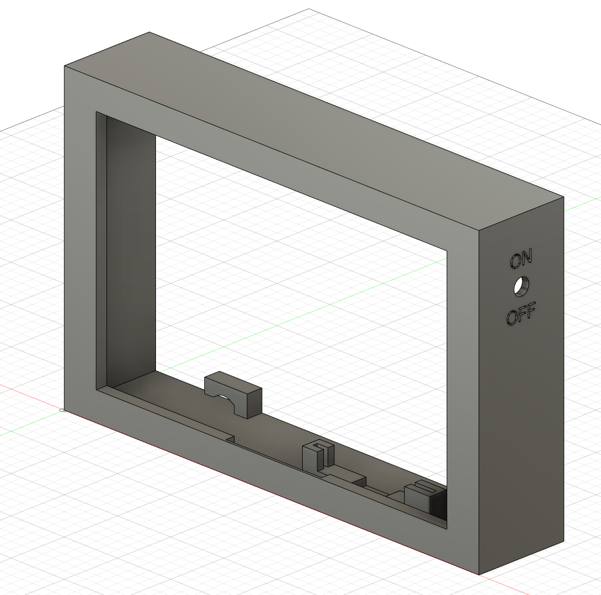
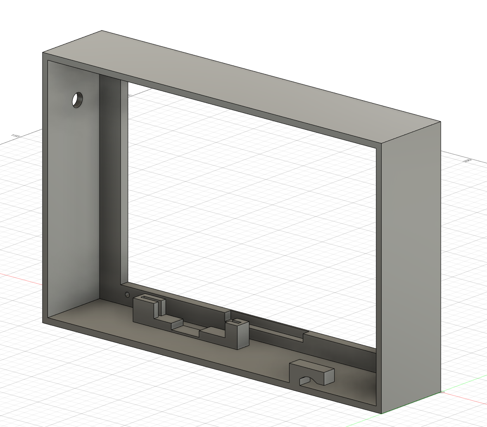

# people-display

[](https://github.com/hnefatl/people-display/actions/workflows/exporter-docker.yaml)
[](https://github.com/hnefatl/people-display/actions/workflows/display-docker.yaml)

A display screen showing people and zone information from a Home Assistant instance, rendering them with photos. Think the [Weasley Clock from Harry Potter](https://harrypotter.fandom.com/wiki/Weasley_Clock), but less rustic, more [`rust`](https://www.rust-lang.org)ic, and with realtime user-provided photos.

There are two separate components:
- the display, which runs on a device with a monitor attached (this repo provides complete reproducible configuration for a Raspberry Pi 3).
- the exporter, which runs on a potentially different device and communicates with a Home Assistant instance to gather relevant information.

The goal of the two components is to allow for multiple independent and locally-owned exporter instances aggregated to a single display. Which data is available from Home Assistant to the display is controlled entirely by the relevant exporter, giving strong privacy guarantees (want to stop being tracked entirely? `docker down` the container).

In practice, I'm going to give a display to my parents so they can see me move around, like the Weasleys watched their children. I'll run an exporter instance connected to my Home Assistant, and potentially other people in my family can do the same for their HA instances.

## Configuration

### Command line arguments

The docker containers are configured using environment variables. All environment variables can be passed either directly as literals or read from the contents of a file, by using the variable name suffixed by `_FILE`.

For example, configuration value `PORT=12345` can be passed using docker's `-e FOO=12345` or as `-e FOO_FILE=foo` where the file `foo` contains the text `12345`. Any paths used in configuration values must be resolvable _inside the docker container_, since they're read at runtime.

This allows for avoiding writing sensitive data like access keys/passwords to e.g. a version-controlled docker-compose file.

### Exporter

```yaml
services:
  exporter:
    container_name: exporter
    image: hnefatl/people-display-exporter
    restart: unless-stopped
    environment:
      - PORT=12345
      - HOME_ASSISTANT_ENDPOINT=http://192.168.1.10:8123
      - HOME_ASSISTANT_ACCESS_TOKEN_FILE=/files/ha_api_key
      - PERSON_ENTITY_IDS=person.adam,person.bob
      - PHOTO_DIRECTORY=/files/photos
      - PASSWORD_FILE=/files/password
    volumes:
      - /docker_configs/exporter:/files
```

Configuration variable | Usage
--- | ---
`PORT` | The port to listen for connections from the display on. Connections are made using gRPC (HTTP 2).
`HOME_ASSISTANT_ENDPOINT` | The URL to your Home Assistant instance.
`HOME_ASSISTANT_ACCESS_TOKEN` | The [long-lived access token](https://developers.home-assistant.io/docs/auth_api/#long-lived-access-token) authorizing the exporter to talk to Home Assistant.
`PERSON_ENTITY_IDS` | A comma-separated list of Home Assistant Person entity IDs to monitor.
`PHOTO_DIRECTORY` | A path to a directory containing photos of Home Assistant entities. See the [Photos](#photos) section below for details.
`PASSWORD` | The password that the _display_ should authenticate to this exporter with (to ensure the exporter doesn't hand out sensitive information to anyone that connects).

#### Photos

The photos within the directory passed as the `PHOTO_DIRECTORY` configuration variable are used to render the Person and Zone entities read from Home Assistant. They're essentially read by the exporter and transmitted to the display, which renders them.

Only `.png`, `.jpg`, and `.jpeg` image formats are supported.

For entities like `person.adam` and `zone.home`, the photos must be named `person_adam.jpg` and `zone_home.png` (file extensions chosen randomly): replace the `.` in the entity ID with a `_`.

### Display

The display docker container is intended to be run as part of the standard reproducible installation on a Raspberry Pi 3, as described in the [Running the display on a Raspberry Pi 3](#running-the-display-on-a-raspberry-pi-3) section below. _This is the only supported deployment option_, although realistically you can run the display almost anywhere with a screen (either inside a docker container or compiled locally and run bare-metal).

The main challenge with running the display in a docker container is passing through enough host state to allow interacting with the local display server. 

The display doesn't support hardware acceleration, because I couldn't work out how to OpenGL hardware acceleration working within a docker container. That simplifies things, and the display isn't exactly render-heavy anyway. It's trivial to modify the code to enable SDL/OpenGL hardware acceleration if compiling for a bare-metal deployment.

```yaml
services:
  display:
    container_name: display
    image: hnefatl/people-display
    restart: unless-stopped
    environment:
      - CONFIG_FILE=/files/config
      # Alternatively specify a config inline on the command line like:
      #- CONFIG: {"endpoints": [{"uri": "http://192.168.11:12345", "password": "foobar"}]}

      # Potentially required for docker to interact with the host display server on your system.
      - DISPLAY=:0
      - XDG_RUNTIME_DIR=/tmp
    volumes:
      - /docker_configs/display:/files
      - /tmp:/tmp
```

The display only takes one configuration parameter `CONFIG` (or `CONFIG_FILE` to pass a file path containing the config), which must be a JSON-format representation of the [`Config` struct](display/src/config.rs). This is necessary versus just taking separate config parameters as environment variables due to the more complex nesting structure of the display config.

### Running the display on a Raspberry Pi 3

The display is intended to be deployed on a Raspberry Pi 3, and this repo contains an out-of-the-box method to perform easy reproducible installations using DietPi.

1. Download the [DietPi image for Raspberry Pi 3](https://dietpi.com/#downloadinfo).
1. Flash it to an SD Card (e.g. using `dd`).
1. Run [`copy_files.sh`](display-deploy/copy_files.sh), pointing it to the SD card device.
    - Required configuration variables are described in the usage text for that script.
    - You may create a file in the same directory called `preesed-variables.sh`, which will be sourced by `copy_files.sh`, to avoid passing everything on the command line.

Then plug the SD card into the pi and boot it up. It'll automatically install DietPi and configure the display to run on startup and update automatically.

On first boot after installation, it may take a while to download the docker images.

#### Configuring the linux installation

The linux deployment scripts are tailored to specifically my personal use-case, so may need to be tweaked to fit yours. In particular, it's expected that Wireguard will be configured such that when the Pi is installed in a remote site it'll connect back to a local Wireguard peer, to allow for easy remote connection.

## Hardware and case

### Components

The most significant components are a Pi 3 and a 7" display. Power+video connections use ribbon cables with right-angle endpoints to keep the profile small (reducing the distance from the side of the disply to the side of the case, to avoid a huge bezel).

| Name | Number | Price per unit | Description
| --- | --- | --- | ---
| [Raspberry Pi 3 Model B](https://www.pi-shop.ch/raspberry-pi-3) | 1 | 42.90 CHF |
| [HDMI 7" 800x480 Display Backpack - Without Touch](https://www.adafruit.com/product/2406) | 1 | 71.96 CHF | The screen: has a bit of a weird flickering issue on some images, but generally works well.
| [Right-angle HDMI ribbon end male](https://www.pi-shop.ch/right-angle-hdmi-plug-adapter) | 1 | 4.90 CHF | Low-profile, to leave only a small distance between the display side and the side of the case.
| [Straight HDMI ribbon end male](https://www.pi-shop.ch/straight-hdmi-plug-adapter) | 1 | 8.90 CHF | Terminating other-end for the right-angle cable.
| [Machine Screw Pan Phillips 4-40](https://www.digikey.ch/en/products/detail/keystone-electronics/9900/317321) | 4 | 0.0728 CHF | Screws for fastening the display into the case.
| [Micro-USB Power Supply](https://www.digikey.ch/en/products/detail/raspberry-pi/SC0624/15298145) | 1 | 7.20 CHF
| [Right-angle USB Micro-B male](https://www.adafruit.com/product/4105) | 1 | 4.31 CHF | Similar low-profile plug for display power.
| [Straight USB B male](https://www.adafruit.com/product/4109) | 1 | 4.31 CHF |
| [10cm USB ribbon cable](https://www.adafruit.com/product/3560) | 1 | 1.31 CHF |
| [20cm HDMI cable](https://www.pi-shop.ch/diy-hdmi-cable-0-2m-ffc) | 1 | 4.90 CHF |
| | | 150.9812 CHF |

### Case

The case is 3d-printable (front-down on the bed). [This is the `.stl` file for printing](case/display.stl), and [here's the `.f3d` file for modelling](case/display.f3d).




## Features

See [the TODOs](TODO.md) for a complete/incomplete feature list.
